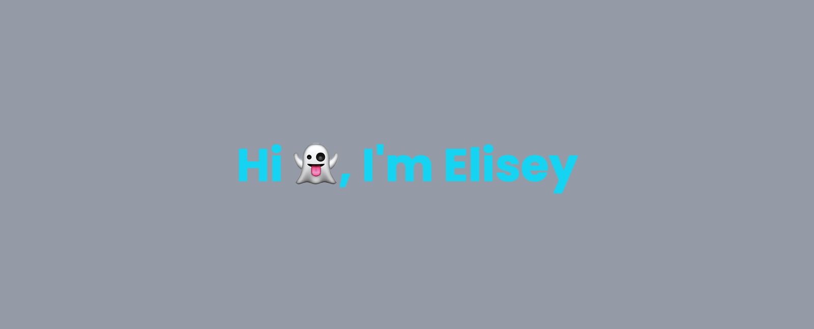

## About me:
👉 I work as a Frontend developer and Fullstack developer🧑🏼‍💻📈
 
👉 Student of school 21 from Sber
 
👉 I really like programming, especially when you can see the result right away🧑🏼‍💻
 
👉 I want to study mobile development and Golang📲💻
 

<h3 align="left">Languages and Tools:</h3>

<h3 align="start">Connect with me:</h3>

